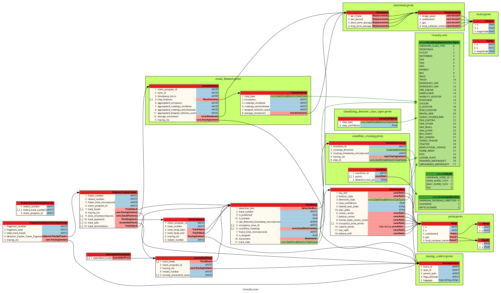

# vivacity-proto-buffet
Public-access repo with Vivacity's protobuf message schema

## Introduction
This is a schema for exchanging data on detection of objects on roads (eg cars, pedestrians, cyclists).

This schema is made publically available to encourage cross-industry collaboration and open exchange of data. It is also intended to:
- Assist consumers of detection data by ensuring some degree of interoperability between various sources which supply the data
- Allow new suppliers of data sources (eg detectors) to enter the market through access to an agreed-upon specification.
- Provide purchasers of future detection capabilities an easier route to procuring and understanding interoperability
- Cover current and future technologies.
- Facilitate collaboration by being open-source and extensible.

## Why Use Protobuf?
Protocol buffers are a language-neutral, platform-neutral extensible mechanism for serializing structured data. Compilers to create source code for handling these messages are available for all popular programming langages.

More information on protocol buffers can be found here:
https://developers.google.com/protocol-buffers

Serialisation ensures that messages are compact, saving bandwidth. The structured nature of the schemas, and their ease of extensibility makes collaboration and updates simple.

The job of packing and unpacking data for transmission is handled automatically by source code generated by the protobuf complier. This means effort can be focussed on the application producing or consuming the data, rather than the "nuts and bolts" of messaging and transmission.

The protobuf tutorials are an excellent way to understand how to use these schemas:
https://developers.google.com/protocol-buffers/docs/tutorials

## Supported Languages <a name="supported"></a>
Generating protobuf classes should be as simple as calling, from the project root directory:
```bash
./generate_<language>.sh
```
If a custom file path to store the generated proto classes is required, call:
```bash
./generate_<language>.sh custom/path/for/generated/proto/classes
```
This should generate a folder called `vivacity` with the `*.proto` files and generated protobuf classes in your specified folder. e.g. for golang:
```bash
└── vivacity-proto-buffet
    ├── core
    │   ├── alerts.pb.go
    │   ├── alerts.proto
    │   ├── classifying_detector_class_types.pb.go
    │   ├── classifying_detector_class_types.proto
    |   ├── ...
    |   └── ...
```
### **All Languages Requirements**:
* protoc >= v3.11.0
#### **<u>Go</u>** <a name="golang"></a>
* protoc-gen-go >= 1.4.0:
    * **Required**. Install by running `go get -u github.com/golang/protobuf/protoc-gen-go`
#### **<u>Python</u>** <a name="python"></a>
* Optional **grpc support** - allows script to call `python -m grpc_tools.protoc` and generates `*_pb2_grpc.py` files. `requirements.txt` is given below:
  ```txt
  grpcio
  protobuf==3.11.0
  grpcio-tools
  ```

#### **<u>Javascript / Typescript</u>** <a name="js-ts"></a>
* `ts-protoc-gen` >= 0.12.0
    * **Required**. Install with `yarn add ts-protoc-gen`

## Vivacity Message Schema


## Message Types
### Summary
The protobuf schema organises messages into a hierarchy which is visualised graphically in the image above. Protobuf permits fields not marked as `required` to be omitted. Therefore even though the schema has a relatively deep "tree" of nested messages, it is possible to send relatively concise messages if only particular features are required.

Depending upon the use case, one or more nested messages may be sent, with a variety of fields populated.

## Message Descriptions
### Detector Tracker Frame
As can be seen graphically in the image above, the Detector Tracker Frame (DTF) is the outermost message type. It is the fundamental output of the Vivacity computer vision system and contains most other important messages types within it.

It contains both important engineering values (zonal occupancy, detection classification, object position etc) as well as metadata such as the id of the sending system and timestamp.

The Vivacity computer vision system emits one DTF for every "frame" of video which is processed. A typical Vivacity sensor might run at 15 frames per second, with all detection inference and processing being performed immediately after a frame is captured. 15 times per second a DTF is emitted, populated with all the features which are enabled on that sensor. 

Description of key fields: 

- `frame_time_microseconds`: Unix time that the frame was processed, measured in microseconds
- `vision_program_id`: Unique identifier of the "vision program" that emitted this DTF. Note: multiple computer vision programs may run on a single piece of hardware - so this is not necessarily the unique ID of the hardware.
- `track_heads`: a list of Track Head messages, one for each tracked object within view (see below)
- `zone_oriented_features` a list of Zonal Features messages, one for each zone configured (see below)

### Track Head
The Vivacity Sensor tracks detected object through its field of view. A track is made up of multiple individual detections - the most recent is known as the Track Head - and can be assumed to contain the most up to date information about the detected object, eg: its current location. 

Key fields:
- `detection_box`: A `DetectionBox` message containing information about the position of the detected object.
- `track_number`: A unique ID for the detected object that lasts for the lifetime of the object within the field of view. 
- `is_predicted`: A flag indicating whether the computer vision system is predicting this Track Head and not directly observing it. For example, may be set `true` if an object is temporarily occluded by another object passing in-front of it - causing the sensor to momentarily lose sight of it.
- `last_detected_timestamp_microseconds`: if `is_predicted` is `true`, this is the timestamp of the previous non-predicted detection of the object.
- `occupancy_zone_id`: a list of the zones that the object is currently within. Zone IDs are globally unique. 
- `countline_crossings`: a list of the countlines that the track has crossed since it was first instantiated.
- `frame_time_microseconds`: Unix time that the frame was processed, measured in microseconds. If this Track Head is within a DTF, this is the same as the `frame_time_microseconds` within the outer message.
- `is_stopped`: flag which is set true when the object is deemed to have stopped moving.
- `movement`: message containing data on the movement of the detected object (speeds, directions etc). See below.
- `track_class`: The classification of the detected object.

### Detection Box
A message containing information about the position of the detected object.

Note that the `Point` message is used repeatedly within this message, and may encode the location in either image space or real (GPS) space.

Key fields:
- `top_left`, `bottom_right`, `center_center`, `center_center`, `top_right`, `bottom_left`: the locations of the various points of the detection box containing the object.
- `detection_class`: the classification of the object. Note that if this `DetectionBox` message is within a TrackHead, this will be the same as the `track_class` from the outer message.
- `occupancy_zone_points`: points which are located within a detection box which are used to determine whether a detected object counts as "within" a zone or not. Eg: 6 points located in the lower half of a vechicle's detection box, 4 of which must be within a zone to contribute to that zone's occupancy.
- `hashed_anpr_plate`:  hashed contents of a license plate.
- `anpr_plate`: raw contents of a license plate.

### Point
A message encoding the position of a point in image space and/or gps space.

Key fields:
- `x`, `y`: the x and y coordinates in the chosen coordinate system. 
- `undistorted`: the position when correcting for lens distortion
- `gps`: the position when transforming the image space coordinates into real-world GPS coordinates on a ground-plane
- `local_cartesian_meters`: the distance in meters from a given point, eg the location of the sensor, or a stopline.


### Zonal Features
This message contains data from a zone-oriented (rather than detected-object-oriented) perspective. Ie: it's a list of things happening inside a zone (eg a pedestrian waiting area), rather than a list of things that are true about an object (eg a pedestrian walking on a path).

Key fields:
- `vision_program_id`: Unique identifier of the "vision program" that emitted this DTF. Note: multiple computer vision programs may run on a single piece of hardware - so this is not necessarily the unique ID of the hardware. If this Zonal Features message is within a DTF, this is the same as the `vision_program_id` in the outer message.
- `zone_id`: A globally unique ID for the zone in question.
- `timestamp_micro`: Unix time that the frame was processed, measured in microseconds. If this Zonal Feautures message is within a DTF, this is the same as the `frame_time_microseconds` within the outer message.
- `class_features`: A list of `ClassFeatures` messages - each one providing information on a particular class of object detected within the zone. 
- `aggregated_occupancy`: total number of detected objects within the zone, aggregated across all classes.
- `aggregated_crossings_clockwise`: total number of crossings of countlines that have occurred within the zone in the clockwise direction, since the previous message. Aggregated across all classes.
- `aggregated_crossings_anticlockwise`: total number of crossings of countlines that have occurred within the zone in the anitclockwise direction, since the previous message. Aggregated across all classes.
See *Countline Crossings* for description of crossing direction logic.
- `aggregated_stopped_vehicles_count`: total number of stopped objects within the zone - aggregated across all detection classes.
- `average_movement`: *Movement* message containing an average across all objects within the zone. 

### Class Features
Used to encode date on a per-class basis in a ZonalFeatures message.
- `class_type`: the type of the class in question
- `occupancy`: the total number of objects of this class within the zone
- `crossings_clockwise`: number of crossings of countlines for objects of this `class_type` that have occurred within the zone in the clockwise direction, since the previous message.
- `crossings_anticlockwise`: number of crossings of countlines for objects of this `class_type` that have occurred within the zone in the anitclockwise direction, since the previous message.
- `stopped_vehicles_count`: total number of stopped objects of this `class_type` within the zone.
- `average_movement`: *Movement* message containing an average across all objects of this `class_type` within the zone. 

### Countline Crossing
A message to communicate a tracked object crossing from one side of a 2D "countline" to the other.

Key fields:
- `countline_id`: a globally unique ID of the countline which has been crossed. 
- `crossings_direction` 


## Use cases
The following use cases are provided as examples of ways in which the schema has been employed in the communication of detection data.


### Use Case 1: Sensors mounted above signal heads, send real-time zonal occupancy messages to a traffic signal controller via a local ethernet network
Messages and fields sent:
```bash
└── DetectorTrackerFrame
    ├── frame_time_microseconds
    ├── vision_program_id
    ├── zone_oriented_features
    │   ├── zone_id
    │   ├── class_features
    │   │   ├── class_type
    │   │   ├── occupancy
    │   │   ├── stopped_vehicles_count    
    │   ├── aggregated_occupancy
    |   └── aggregated_stopped_vehicles_count
```
Phyiscal and Transport layers: DTFs are sent via TCP connection over an ethernet network. Messages are sent at a fixed rate of 10Hz.

Zones are configured for:
- pedestrian waiting areas
- pedestrian on-crossing areas
- cycle lane approaches
- bus lane approaches
- vehicle approaches

The traffic signal controller receives the data and uses the classified occupancy values to determine signal timings, eg: hold the "green man" while there is a non-zero pedestrian occupancy in the on-crossing zone, or insert a demand for a cyclist phase if cyclists are detected approaching the junction. 

### Use Case 2: Sensors mounted above signal heads, send real-time GPS locations to a central algorithm, via a council-owned ethernet network and fibre backhaul

### Use Case 3: Sensors mounted on lamp columns, send instantaneous countline crossing events via 4G to a cloud-based central signal coordinator
